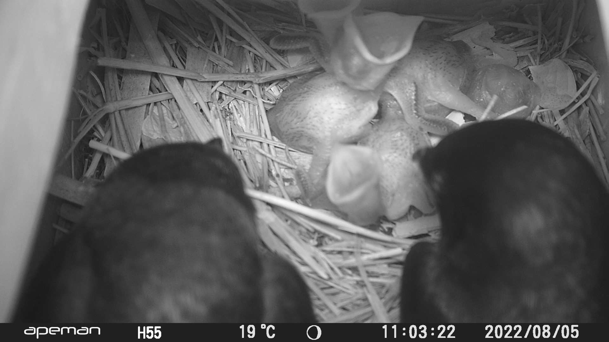

# Extracting text from wildlife camera videos

In this notebook, I use OpenCV ad pytesseract to extract text from frames of video. The videos are part of a wildlife monitoring program to seeks to better understand nesting behaviour of Purple Martins. The cameras are set to take a 5 second video inside the nest box if movement is detected. There is a 1 hr delay between videos and the cameras captures several months worth of data. The cameras inlay temperature, time and date information in the video which I wish to extract. There are cameras setup on un several nest boxes and each camera has produced thousands of videos. Automating this process will save many man hours of annotation time. Below is a example screen shot of a single frame from one of these videos. 
